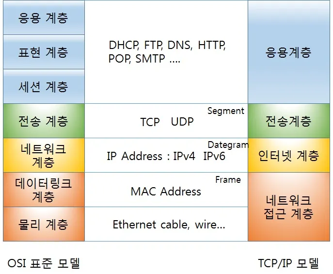

> # _인터넷 프로토콜_
>
> ## 【Ⅰ】. 인터넷의 계층 구조 개요
>
> > ▶ 인터넷은 전 세계의 컴퓨터와 네트워크 장치를 연결하는 복잡한 네트워크 시스템\
> > ▶ 이에 복잡한 시스템을 원활히 소통할 필요성이 커짐\
> > ▶ 이에 따라 계층화된 구조로 설계함\
> > ▶ 구조의 계층화를 통해 데이터가 네트워크를 통해 **효율적**이고 **안전하게** 전달되게 보장함\
>
> ### 목차
>
> > 【Ⅰ】. 《1》 계층화를 해야하는 이유
> >
> > -  【Ⅰ】. 《1－1》 관리의 용이성
> > -  【Ⅰ】. 《1－2》 유지보수 및 개발의 단순화
> >
> > 【Ⅰ】. 《2》 계층화의 2가지 모델 (TCP/IP & OSI)
> >
> > -  【Ⅰ】. 《2－1》 TCP/IP 모델
> > -  【Ⅰ】. 《2－2》 OSI 모델
> > -  【Ⅰ】. 《1－3》 계층화의 모델을 통하여...
>
> ### 【Ⅰ】. 《1》 계층화를 해야하는 이유
>
> > ▶ **【Ⅰ】. 《1－1》 관리의 용이성**
> >
> > -  네트워크의 복잡성을 나눔으로써 관리를 쉽게함.
> > -  계층화는 각 단계마다 고유한 역할을 수행.
> >
> > ▶ 【Ⅰ】. 《1－2》 **유지보수 및 개발의 단순화**
> >
> > -  네트워크의 각 요소가 독립적으로 설계 및 관리되게 함
> > -  각각의 계층을 구분하여 새로운 기술의 등장하여도 기존의 프로토콜이나 구조에 최소한의 영향을 미치게함
>
> ### 【Ⅰ】. 《2》 계층화의 2가지 모델 (TCP/IP & OSI)
>
> > \
> > \
> > \
> > ▶ **【Ⅰ】. 《2－1》 TCP/TP 모델** **_(Transmission Control Protocol / Internet Protocol . Model)_**
> >
> > -  인터넷 설계와 운영에 기반한 4계층의 구조
> > -  실용적이고 널리 사용됌
> > -  실제 인터넷과 관련된 통신에서 많이 사용
> > -  보다 단순하고 실제 구현 중심
> > -  **_TCP/IP_** 는 묶어서 표현할 뿐 각각 별개의 역할과 영역을 책임짐.
> >
> > ▶ **【Ⅰ】. 《2－2》 OSI 모델** **_(Open Systems Interconncection Reference Model)_**
> >
> > -  국제 표준화 기구(ISO)에서 개발한 모델
> > -  컴퓨터 네트워크 프로토콜 [**디자인**] 과 [**통신**]을 계층으로 나누어 개념적으로 설명함.
> > -  일반적으로 **[OSI 7계층]** 이라고 부름
> > -  각 계층을 **L(layer)** 로 구분 (L1: 물리계층, L5: 세션 계층 등)
> > -  **컴퓨터는 OSI 7개의 계층을 모두 포함함**
> > -  TCP/IP는 이론적 체계가 정립되기 전, 옛날에 설계되어 이에 잘 들어맞지 않아 계층이 두루뭉술 엮여있음
> >
> > ▶ **【Ⅰ】. 《1－3》 계층화의 모델을 통하여...**
> >
> > -  모델을 통해 데이터는 [**응용 계층**]에서 [**물리 계층**]으로 전달
> > -  최종적으로 목적지의 장치에서 다시 [**물리 계층**]에서 [**응용 계층**]으로 복원
> > -  이러한 흐름을 이해하여 네트워크의 작동 원리와 문제 해결 방법을 명확하게 파악할 수 있음
>
> ##
>
> ## 【Ⅱ】. TCP/IP와 OSI
>
> ###
>
> 1. TCP (Transmission Control Protocol)
> 2. IP (Internet Protocol)
> 3. OSI (Open Systems Interconnection Reference Model)
>
> ## Ⅱ）1. TCP
>
> ## Ⅱ）2. IP
>
> ## Ⅱ）3. OSI

> ##
> 
> ##