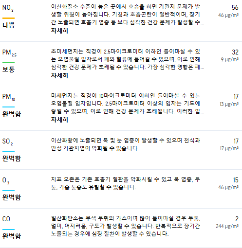
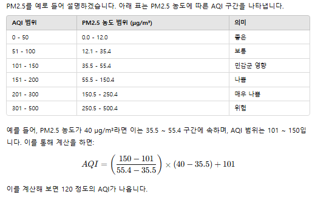

http://api.openweathermap.org/data/2.5/air_pollution?lat={lat}&lon={lon}&appid={API key}

127

http://api.openweathermap.org/data/2.5/air_pollution?lat=37.5833&lon=127&appid=f24ef11ff3ac3759827b92ca024bf829

```diff
! 대기오염 측정
{
  "coord": {
    "lon": 127,
    "lat": 37.5833
  },
  "list": [
    {
! 대기질 심각 레벨
      "main": {
        "aqi": 4
      },
!  { co: 일산화탄소 }, { no: 일산화질소 }, { no2: 이산화질소 }, { o3: 오존}, { so2: 아황산가스 }, { pm2_5: 초 미세먼지 }, { pm10: 미세먼지 }, [ nh3: 암모니아 ]
      "components": {
        "co": 1895.91,
        "no": 300.41,
        "no2": 90.48,
        "o3": 0.83,
        "so2": 61.99,
        "pm2_5": 51.51,
        "pm10": 60.85,
        "nh3": 1.22
      },
      "dt": 1731633706
    }
  ]
}
```

https://maps.openweathermap.org/maps/2.0/weather/1h/{op}/{z}/{x}/{y}?appid={API key}

https://maps.openweathermap.org/maps/2.0/weather/1h/PR0/8/255/255?appid=f24ef11ff3ac3759827b92ca024bf829

clouds_new

https://tile.openweathermap.org/map/{layer}/{z}/{x}/{y}.png?appid={API key}

https://tile.openweathermap.org/map/clouds_new/2/3/3.png?appid=f24ef11ff3ac3759827b92ca024bf829

api.openweathermap.org/data/2.5/forecast?id=1835847&appid=f24ef11ff3ac3759827b92ca024bf829

```
{
  "coord": {
    "lon": 126.7317,
    "lat": 37.4536
  },
  "list": [
    {
      "main": {
        "aqi": 3
      },
      "components": {
        "co": 1094.82,
        "no": 114.44,
        "no2": 119.27,
        "o3": 5.01,
        "so2": 53.41,
        "pm2_5": 46.94,
        "pm10": 58.71,
        "nh3": 1.88
      },
      "dt": 1731650508
    }
  ]
}
```



ppm
ug/m^3 _ 0.001_ (24.45/분자량)\
No2 : 46.0055

이산화질소 : 46.0055g/mol
아황산가스 : 64.066g/mol
오존 : 48g/mol
일산화탄소 :28.01g/mol

25℃, 1기압(760torr)조건\
=> ppm=(mg/m^3 _ 24.45)/몰질량
=> ppm=(ug/(m^3 _ 1000) _ 24.45)/몰질량
=> ppm=(ug/m^3)_(24.45/(몰질량 \* 1000))

3.48125

https://api.openweathermap.org/data/2.5/air_pollution/forecast?lat=37.453609&lon=126.731667&appid=f24ef11ff3ac3759827b92ca024bf829
(1시간마다 예측 대기오염3일치)

과거 대기오염
http://api.openweathermap.org/data/2.5/air_pollution/history?lat=37.453609&lon=126.731667&start={start}&end={end}&appid={API key}

http://api.openweathermap.org/data/2.5/air_pollution/history?lat=37.453609&lon=126.731667&start=1731628800&end=1731654000&appid=f24ef11ff3ac3759827b92ca024bf829

1731628800
1731654000

ug/m^3 0.001\_ (24.45/분자량)\
$\bf{ppm = ug/m^3 × 0.001 × (24.45/몰질량)}$\
$\bf{ppb = ug/m^3 ×  (24.45/몰질량)}$

AQI 지수 계산



AQI 계산표
| AQI 구간 | PM2.5 (μg/m³) | PM10 (μg/m³) | CO (ppm) | O3 (ppb, 8시간)| NO2 (ppb) | SO2 (ppb) |
| :---: |:---: | :---: | :---: | :---: | :---: |:---: |
|0 - 50| 0.0 - 12.0| 0 - 54| 0.0 - 4.4| 0 - 54 |0 - 53| 0 - 35|
|51 - 100| 12.1 - 35.4| 55 - 154| 4.5 - 9.4| 55 - 70| 54 - 100| 36 - 75|
|101 - 150| 35.5 - 55.4| 155 - 254| 9.5 - 12.4| 71 - 85| 101 - 360| 76 - 185|
|151 - 200| 55.5 - 150.4| 255 - 354| 12.5 - 15.4| 86 - 105| 361 - 649| 186 - 304|
|201 - 300| 150.5 - 250.4| 355 - 424| 15.5 - 30.4| 106 - 200| 650 - 1249| 305 - 604|
|301 - 500| 250.5 - 500.4| 425 - 604| 30.5 - 50.4| 201 - 604| 1250 - 2049| 605 - 1004|

이산화질소 : 46.0055g/mol
아황산가스 : 64.066g/mol
오존 : 48g/mol
일산화탄소 :28.01g/mol

co*0.001*(24.45/46.0055)

```
 { aqi: "0-50", pm2_5: [0, 12.0], pm10: [0, 54], co: [0, 4400], o3: [0, 54], no2: [0, 0.053], so2: [0, 35] },
  // "보통" 범위
  { aqi: "51-100", pm2_5: [12.1, 35.4], pm10: [55, 154], co: [4500, 9400], o3: [55, 70], no2: [0.054, 0.1], so2: [36, 75] },
  // "민감군 영향 있음" 범위
  { aqi: "101-150", pm2_5: [35.5, 55.4], pm10: [155, 254], co: [9500, 12400], o3: [71, 85], no2: [0.101, 0.36], so2: [76, 185] },
  // "나쁨" 범위
  { aqi: "151-200", pm2_5: [55.5, 150.4], pm10: [255, 354], co: [12500, 15400], o3: [86, 105], no2: [0.361, 0.649], so2: [186, 304] },
  // "매우 나쁨" 범위
  { aqi: "201-300", pm2_5: [150.5, 250.4], pm10: [355, 424], co: [15500, 30400], o3: [106, 200], no2: [0.65, 1.249], so2: [305, 604] },
  // "위험" 범위
  { aqi: "301-500", pm2_5: [250.5, 500.4], pm10: [425, 604], co: [30500, 50400], o3: [201, 604], no2: [1.25, 2.049], so2: [605, 1004] },
  ```